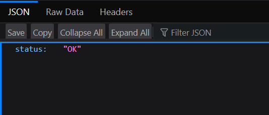
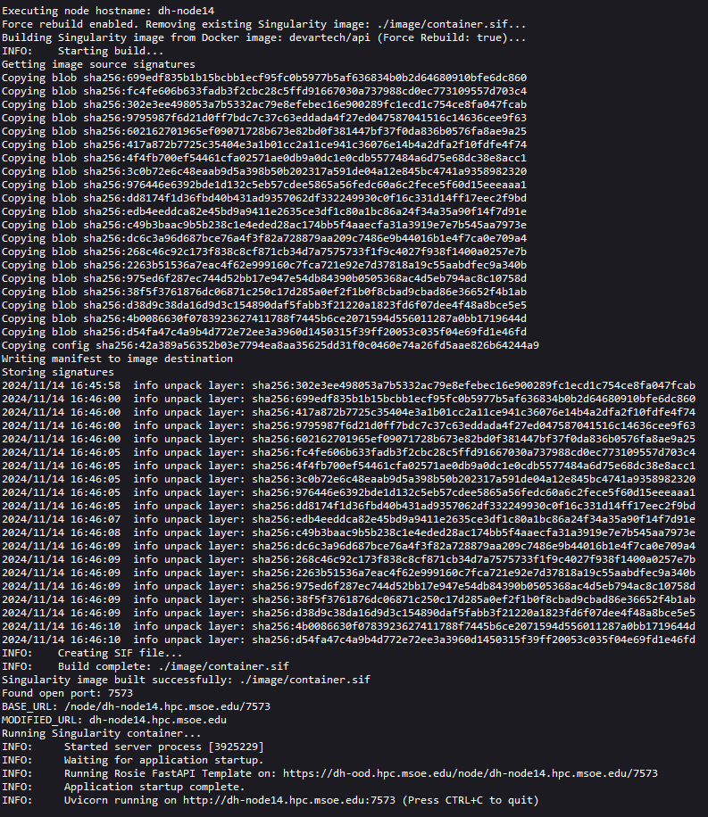

# Rosie FastAPI Application Template
Adam Haile - 10/2024

> **NOTE: BEFORE CLONING LOCALLY, RUN THE FOLLOWING COMMAND!! `git config --global core.autocrlf false`**

> Requires: Python 3.12, pipenv, [Docker](https://docs.docker.com/get-started/get-docker/), [Docker Hub](https://app.docker.com/signup?_gl=1*8zm98o*_gcl_au*NDgyODM1ODIwLjE3MjgzMjUzMzA.*_ga*MTY2ODMxMDUxLjE3Mjc0NjkwMTg.*_ga_XJWPQMJYHQ*MTczMTYyMTczNi43LjEuMTczMTYyMTc0Mi41NC4wLjA.), Rosie Access

This template is meant to be a starting point for creating a new Rosie application in Python via a FastAPI. This FastAPI application includes built in security to ensure users across Rosie cannot access endpoints without credentials, templating for adding/modifying/removing your own API endpoints, and documentation on how to deploy to Rosie. It includes a basic directory structure and some example code to get you started.

## Local Development
This application uses [pipenv](https://pipenv.pypa.io/en/latest/) for local development. To set up the pipenv locally, you can run the following commands on your local machine:
```
pip install pipenv
```
```
pipenv install -d
```
```
pipenv run start
```

Once you have run `pipenv run start`, the server will spin up and provide you with a URL you can use to access your API (default: http://localhost:8080). If everything is working correctly, you should see the following:


You can then access the Docs page via http://localhost:8080/docs
The docs page will have a health endpoint, and 4 example endpoints by default. These example endpoints are a set of basic CRUD endpoints, and can be found at [example.py](./src/routes/example.py).

You can also modify the base information of the application in the [api.py](./src/api.py).

## Directory Structure
This section is a brief introduction to what everything does in this template, and what you should look at when making your own application. These are sorted from files you should change for your application, to ones you should never even open.
### Source Code
 - [./app/routes/example.py](./app/routes/example.py): This is an example FastAPI router which has a basic CRUD application attached to it. This APIRouter is attached to the API by default. **You can modify this file however is necessary for your application.**
</br></br>
 - [./app/core/models.py](./app/core/models.py): This script contains an example Pydantic model used to conform a FastAPI body to a type which is standardized for the rest of the method. **You can modify this file however is necessary for your application.**
 </br></br>
 - [./app/api/api.py](./app/api/api.py): This contains the endpoint for the root path ("/") as well as imports all routers being used (the example router). All new routes should be included here.
</br></br>
 - [.env](./.env): This file will contain any sort of local variables you may need for your application. The [settings.py](./src/models/settings.py) will take care of reading all these in and adding them to the API's environment. The default .env file only needs a declaration of environment to ensure the docs are routed correctly. **This file is only used for local development, you should not push this to Docker Hub or Rosie.**
 </br></br>
 - [./app/core/settings.py](./app/core/settings.py): This contains the settings which are defined as environment variables within the container. These should be predefined outside of the API, otherwise there will be errors. For local development, they can be defined in the [.env](./.env) file and will be imported in.
</br></br>
 - [Pipfile](./Pipfile): The Pipfile manages your dependencies, versions, and additional scripts. Add new dependencies under `[packages]`, add dependencies which you only use during local development under `[dev-packages]`, modify the python version under `[requires]`, add your own scripts which can ran with `pipenv run ...` under `[scripts]`.
 </br></br>
 - [./app/core/settings.py](./app/core/settings.py): This file controlls the base settings of the application. By default, it just reads in the variables declared in [.env](./.env). Variables which specify application naming are declared here.
</br></br>
- [./app/core/middleware](./app/core/middleware/): This folder contains middleware, middleware are scripts that can be executed before and after the actual logic which an endpoint should execute. This can be things such as profiling, logging, etc. The middleware folder currently contains a file ([./app/core/middleware/token_validator.py](./app/core/middleware/token_validator.py)) which protects the API from being accessed by external users by validating a token first, this is disabled when developing locally. You can add your own middlewares to here and include them in [./app/main.py](./app/main.py).
<br><br>
- [./app/main.py](./app/main.py): This is the master API file. This file manages configuring your FastAPI to work with Rosie. Other than adding middleware (if you make your own), you generally should not need to change anything in this file . All new routers should be added to [./app/api/api.py](./app/api/api.py)
</br></br>
 - Dockerfile: The Dockerfile builds your API to a Docker Image which you then deploy the Docker Hub. Unless you need to add additional folders that are not in [src](./src), to the image/change the Python version, or import additional external models into the container, you generally shouldn't have to touch this file.
 </br></br>
 - Pipfile.lock: This file contains the hashes needed for your dependencies to work with pipenv. Do not directly modify this file, pipenv will use this for you.

### Rosie OOD
> **NOTE: Only use this folder if you have Rosie Sandbox access.** The following list is the items you should check out, anything not listed here you generally shouldn't need to change. To find more information, check the OOD docs: https://osc.github.io/ood-documentation/latest/
- [template/before.sh.erb](./rosie_ood/template/before.sh.erb): This contains the code for a shell script that is executed immediately before container startup. **NOTE: SET THE PATH FOR YOUR CONTAINER IMAGE AT `container` BEFORE RUNNING YOUR APPLICATION ON ROSIE (See [Deploying to Rosie](#deploying-to-rosie) for more information). If you changed the token prefix in the API, update that here too at the "prefix" variable.**
</br></br>
- [template/script.sh.erb](./rosie_ood/template/script.sh.erb): This contains the code for a shell script that is executed on container startup. **NOTE: SET THE PATH FOR YOUR CONTAINER IMAGE IN THE SINGULARITY COMMAND AT THE BOTTOM OF THE SCRIPT BEFORE RUNNING YOUR APPLICATION ON ROSIE (See [Deploying to Rosie](#deploying-to-rosie) for more information)**
</br></br>
- [manifest.yml](./rosie_ood/manifest.yml): The manifest contains description information on your application, such as the name, category, subcategory, and description *(Do not change the role)*.
</br></br>
- [view.html.erb](./rosie_ood/view.html.erb): You should only change the name of your application on the button in this file (Default: "Connect to Demo").
</br></br>
- [icon.png](./rosie_ood/icon.png): The icon for your OOD application. Feel free to swap it out with whatever you want to use!
</br></br>
- [info.md.erb](./rosie_ood/info.md.erb): This contains the information to display to the user on the Rosie dashboard regarding their container. This can hold whatever information you think is important to them.

### Developing/Deploying with Models
If you plan to have models packaged into your project, you will add them to both your local environment, and the deployment environment manually. Here is an example using the spacy en_core_web_sm model.

#### Local
- `pipenv shell`
- `python -m spacy download en_core_web_sm`
- `exit`
After these have been run, the model is now installed into the local container. Running the API with `pipenv run start` will now have access to use this model.

#### Deployment
Add the following line to the Dockerfile after the pip install command has been ran:
```
RUN python -m spacy download en_core_web_sm
```
This will install the model into the container, and allow it to be used by the deployed container.

> ***But my model is too large to package into the container! What do you I do?***
>
> You can pre-upload your model to Rosie into a location you can access (/home/{your username}/{model location}) and point your code to use that location. Make sure that if your application is made public to the entire MSOE populace, that it is put somewhere *everyone* can acces (/data/{some shared location}).

## Validating Deployment
You can validate your deployment actually works before deploying to Rosie with the following command:
```
docker run -v "$(pwd):/app" --env-file ./.env -it api
```
> Run this command in the root of the project and ensure your environment variables are declared in `.env`.

## Deploying to Rosie
When you have an application you want to deploy to Rosie, follow these steps:
1. Make sure you have [Docker](https://www.docker.com/) installed as well as a [Docker Hub](https://hub.docker.com/) account
2. Start up Docker so that the Docker Engine is running in the background
3. Execute the following commands in a terminal that is currently working in the project directory.
> If you are adding new packages, run the following command first: `pipenv install`
```
docker build -t "rosie-application" .
```
```
docker tag "rosie-application" "your-docker-hub-username/rosie-application"
```
```
docker push "your-docker-hub-username/rosie-application"
```
4. Once all of those have executed, connect a shell (either via the dashboard or through a terminal) to Rosie.

At this point, steps diverge depending on if you have sandbox access and are planning on building an OOD application, or just want to run your application on Rosie in general.

### Non-Sandbox (Non-OOD)
5. Copy the [run.sh](./run.sh) script over to Rosie in a location you can access. (You probably will want to put this in it's own folder as it will create additional files/directories.) *(You can copy it over via the dashboard from Files > Home Directory)*
6. In the Rosie terminal, navigate into the folder you put the `run.sh` file.
7. Execute `run.sh` using the following command:
```
sbatch run.sh -i your-docker-hub-username/rosie-application
```
> For future executions, assuming you do not need to rebuild the image, you an just run `sbatch run.sh`.
> If you need to rebuild the image, you can either delete the old one or run 
> ```
> sbatch run.sh -f -i your-docker-hub-username/rosie-application
> ```
8. In the Rosie file manager, go to where you put the `run.sh` script. You should now see two folders. `image` and `output`, as well as a `password.txt` file.

    - `image`: Contains the built singularity image for your application
    - `output`: Contains the logs from your server for each instance of the application ran. They are tagged by the sbatch job ids.
    - `password.txt`: Contains a randomly generated password which you can use to access your API. This password is *persistent* (the API will not generate new ones per run, so long as this file exists. To reset your password, just delete this file and restart the server. This file is protected so that only the owner (you) can read/write to it.) **COPY THE PASSWORD INSIDE OF THIS FILE FOR LATER**.

9. Open the `output` folder, and open the newly created file in there. *(It should be titled something like job_123456.out)*
10. You should see an output something similar to this at the top.

    - Let's break down what this log says
        - **Everything before the line "Creating SIF file...**": This is singularity pulling down our docker image and unpacking it for use.
        - **Creating SIF file...**: This is building our singularity image. It is a containerized way to run our code in a stable and reproduceable way.
        - **Found open port -- Running Singularity container...**: The lines here detail some info on the container, these are mostly for debugging purposes and are not necessary for us.
        - **Started server process -- Uvicorn running on...**: These lines are our FastAPI application starting up. These mean the container's environment is configured corectly and our application is running and accessible.
> If you see some of this text, but do not yet see the text saying "Running Rosie FastAPI Template on: ...", wait a bit longer and refresh the page. The image may still be building or the API may still be loading.

11. Copy the URL output in the logs that is at the line which starts with "Running Rosie FastAPI Template on:"

12. Paste this URL into your web browser.
    - This should return a page that looks like this:
     

13. In the password box, put in your password that was generated in password.txt.

Once you complete this, you should be redirected to your docs page of your API! You will remain logged in to your API (meaning you won't be reprompted for your password) as long as the sbatch script is running. If you start a new one, you will be reprompted the first time you go to it.

### Sandbox (OOD)
5. Copy the rosie_ood folder over to Rosie in a location you can access. *(You can copy it over via the dashboard from Files > Home Directory)*
6. Build your image to the image directory of the rosie_ood folder using this command:
```
singularity build rosie_application.sif docker://your-docker-hub-username/rosie-application
```
7. Configure the following files of the rosie_ood folder to use this directory location (ensure that it is from root): [template/before.sh.erb](./rosie_ood/template/before.sh.erb), [template/script.sh.erb](./rosie_ood/template/script.sh.erb) (Note: If you changed the token prefix in the API, reflect that in [before.sh.erb](./rosie_ood/template/before.sh.erb))
8. Feel free to check out the other files to determine what you can change to fit with your application.
9. Navigate to the Interactive Apps section of the Rosie dashboard, and start up your application in the Sandbox. If it does not start or it "completes" before going into Running, click on the Session ID link and go to `output.log` to see the session logs.

Now, your application should be running on Rosie!
